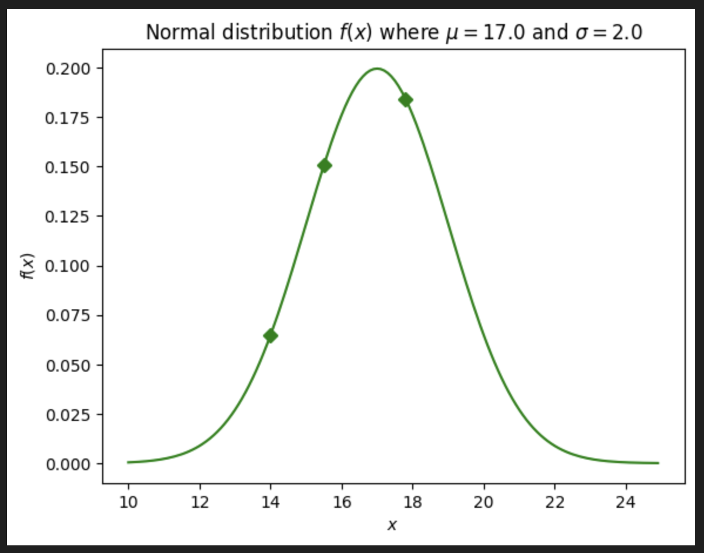

# Bayesian Inference

## Resources

"rasmusab" YouTube 3-part video series - uses the Swedish Fish Company example o illustrate use of Binomial model:

[https://youtu.be/3OJEae7Qb_o?si=1y_0JCztA1GV0R1W]

"Brandon Rohrer" YouTube - uses example of weighing his dog "Reign":

[https://youtu.be/5NMxiOGL39M?si=AyE4OJNZUnTtqWrz]

[https://www.quantstart.com/articles/Bayesian-Statistics-A-Beginners-Guide/]

Barry Van Veen - shows the equivalence of different estimations of the optimal parameter values is actually minimium of different errors like mean squared error (mean of $P(\theta|D)$), absolute error (median of $P(\theta|D)$) and max a posteriori (argmax of $P(\theta|D)$).

[https://www.youtube.com/watch?v=fjqd0gG-5OE] 

[https://www.youtube.com/watch?v=fvNUUJuFXM0]

## Foundational Concepts

There are several distinguishing features of Bayesian Inference compared to classical statistical analysis.  Here are a few features:

- **Thinking of Bayesian analysis as an inverse process**
  In *forward* modelling, we need just need one thing: a generative model + values for its corresponding parameters.  Say a Bernoulli process with values for the parameter $p$.  Using this, we can generate *data*.  For example, we might model the sign up rate for a magazine subscription campaign. We might assume the subscription rate is $p=0.2$ and then proceed to generate data for how many people sign up out of 100 people.  The data points might be, say: 13, 22, 25.  Although $p=0.2$, the stochastic nature of the model means the generated data is not always going to be 20 people.

  Bayesian analysis is doing the inverse.  We start with the data points, then assume a model with corresponding parameters to work out the likely distribution of the sign up rate $p$.  If we have run 3 test campaigns with $n=100$ people in each, then we have 3 data points, say: $k = 43, 45, 51$.  We could use the Binomial distribution $f(k, n, p)$ and a Bayesian analysis will work out the distribution of the sign up rate given the data $f(p|D)$.  Uniquely, Bayesian analysis also allows the incorporation of prior beliefs on the distribution of the parameter, $f(p)$.
- **Prior, Generative Model + Parameter(s), Data**:
  In the Baysian approach to statistics, one follows a recipe that composes of a 3 main things: the prior, the generative model with associated parameter(s) and the data itself.  
  
  The prior, $P(\theta)$, provides a mechanism to incorporate our initial beliefs about how the value of the parameter is distributed. If we don't want to introduce any prior beliefs then one can simply assume $P(\theta) = 1$ i.e it is constant i.e a flat prior.

  A generative model and its associated parameter(s) must be selected before an analysis can commence. An example of a model is the Binomial distribution with its parameter $p$ which determines the probability of a positive result (e.g. a head in a coin flip).  As such, a Bayesian analysis will involve determining the likely distribution of $p$ given the observed data $D$ i.e. $P(\theta = p|D)$.

  In most real-life problems, the data, $D$, is collected and available from the outset.  However, once a Bayesian analysis is completed, it can inform the practitioner what further data might be needed to get a more certain result e.g. how to get a better estimate of the true value of $\theta$.

- **Calculates the likely distribution of the model parameter(s), $P(\theta|D)$:**
  In a classical statistical analysis, one might compute the mean, $\mu$, standard deviation, $\sigma$, and the confidence intervals from the data $D$.  This yields just a *single* value for the $\mu$, $\sigma$ etc. from $D$.  In contrast, a Baysian analysis yields the probablistic distribution of the generative model's parameters $\theta$ i.e. $P(\theta|D)$, which in the case of a Normal distribution are $\theta = \{\mu, \sigma\}$.  This will be drawn out in the example(s) below.

## Bayes Theorem for Inference

Bayes Theorem for inference is conventionally written as follows:

$$P(\theta | D) = \frac{P(D | \theta ) P(\theta)}{P(D)}$$

where $\theta$ are the parameters of a probability distribution and $D$ is the data we have.  In the language of Bayes Theorem, each of the terms in the above formula have the names:

$$ {\tt Posterior} = \frac{ {\tt Likelihood} \times {\tt Prior} }{ {\tt Margin} } $$

Note how the Posterior is equal to the liklihood if the prior is flat.  

## Inferring the Distribution of the Parameters of a Probability Distribution

### An example of weighing Nessie the Dog at the vet

Suppose we go to the vet on 3 separate occasions, and our beloved Nessie is weighed each time she is there.  Due to variabilities from her intrinsic weight, the thickness of her fur coat and how much she has eaten etc. her weight is different each time.  The 3 data points are:

$$ D = [w_1, w_2, w_3] =  [14.0, 15.5, 17.9] $$

where the units are in kilograms (kg).

The question is, what is Nessie's most likely true weight?  We will assume the measurements of her weight are normally distributed, where the normal distribution has the form:

$$ f(x) = \frac{1}{\sqrt{2 \pi \sigma^2}} \exp \left( -\frac{(x-\mu)^2}{2\sigma ^2} \right) $$

In this case, the parameters of the distribution are:

$$ \theta = \{ \mu, \sigma \} $$

where $\mu$ is the mean and $\sigma$ is the standard deviation.  

The objective of this exercise is to compute the distribution $P(\theta|D)$ given the data $D$.  The first term in the Baysian Inference formula is the likelihood, $P(D|\theta)$, and is given by the product of the probabilities that we get each of the observations in $D$ if the probability distribution parameters take the value(s) $\theta$.  For example, if $\theta = \{ \mu = 17.0, \sigma=2.0 \}$ then the conditional probability is:

$$ P(D | \theta = \{ \mu = 17.0, \sigma=2.0 \}) \\ = \\ P(w_1 = 14.0 | \{ \mu = 17.0, \sigma=2.0 \}) \\ \times P(w_2 = 15.5 | \{ \mu = 17.0, \sigma=2.0 \}) \\ \times P(w_3 = 17.9 | \{ \mu = 17.0, \sigma=2.0 \}) \\ = 0.00175...$$

You can visualize the value of each of the factors in this product as the green dots on the current distribution curve:

Clearly, this product is maximized when the distribution is centred around where the most data points reside.

In `example_nessie_v1.ipynb`, $P(D|\mu)$ is computed for a range of $\mu$ values for fixed standard deviation $\sigma=2.0$ yielding the following distribution:

Observe that the most likely value for the mean $\mu$ is around 16.0 kg.  We can now do a similar computation $\sigma$ but keeping $\mu = 16.0$ fixed:

Observe that the most likely value for the standard deviation $\sigma$ is around 1.6 kg.  The combination of the most likely values of the distribution parameters is thus:

$$ \theta = \{ \mu = 16.0, \sigma = 1.6 \} $$

Note that this single set of most optimal values of the parameters to fit the data could have been obtained through curve fitting.  However, this example shows how a Bayesian perspective computes the likely distribution of the parameters values in parameter space i.e $P(D|\mu)$.

# Incorporating Prior Beliefs

Note that Bayes theorem essentially equates the posterior, $P(\theta|D)$, and the likelihood, $P(D|\theta)$ i.e. what we calculated above, if our prior beliefs $P(\theta)$ are flat.  In fact, if we don't want to influence the posterior with our beliefs then the analysis above for the likelihood is essentially equivalent to computing the posterior, since we can just set the prior to a constant $P(\theta)=1$.