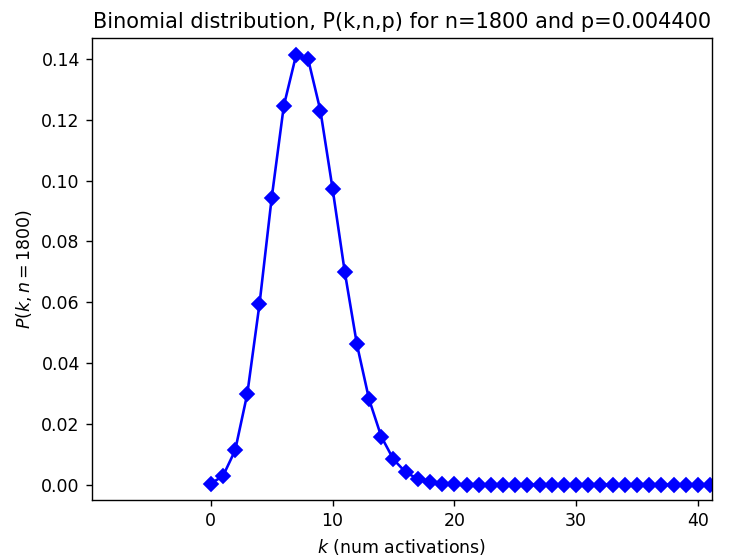

# Understanding Tibia Transcendance, from Binomial to the Poisson Distribution

# Using UV to run Python scripts

This mini essay uses the Python tool `uv` to simplify package management.  To install dependencies do:
~~~
$ uv pip install pyproject.toml
~~~
This install everything into a `venv`.

And to run the scripts do:
~~~
$ uv run main.py
~~~

# What is the Transcendence Effect in Tibia?

[Transcendence](https://tibia.fandom.com/wiki/Transcendence) is an effect that turns your character into avatar form at a certain percentage chance per turn. This can be modelled as a Bernoulli process where each turn a coin is flipped with heads corresponding to a transformation into the avatar form.  This percentage is quite small, with this mini essay considering the tier 3 effect where the chance of success is $p = 0.44\% = 0.0044$.

# Modelling as a Binomial Process

Fundamentally, the [binomial distribution](https://docs.scipy.org/doc/scipy/reference/generated/scipy.stats.binom.html) can describe the number of activations, $k$, we expect from $n$ turns at the activation probability $p$:

$$
f(k) = \begin{pmatrix}
n \cr
k \cr
\end{pmatrix} p^k (1-p)^{n-k}
$$

For example, we could set $p=0.0044$ and $n=1800$ i.e. the number of turns within an hour, and look at the resultant distribution:

We can see that the distribution peaks at around $k = $ 7 and 8 activations, which is the expected mean number of activations in an hour.  But there is also some non-zero distibution around this mean average, and there is some sizable probability that you get more than 10 activations per hour.

Note that the distribution peak is quite near the vertical axes ($k = 0$ activations), and at these limits where $p$ is small, the resultant distribution is well-described by the Poisson distribution, which introduces a quantity $\mu=np$ which has the interpretation of 'number of activations per something' where something is usually time but can also be space amongst possibly other things.

# Modelling the Hunting as a Bernoulli Process and Comparison with Poisson Distribution

Before plotting the Poisson distribution, let's do some Bernoulli modelling of the transcendence process so we can compare some simulated experiments with the theoretical distribution.  The matrix below shows 2000 hours of hunting, with yellow elements indicating successful procs.

Let's work out the histogram for the 'number of procs per hour', which yields:

Let's try and compare this hisotrgram to a [Poisson distribution](https://docs.scipy.org/doc/scipy/reference/generated/scipy.stats.poisson.html):

$$
f(k) = \exp(-\mu) \frac{\mu^k}{k!}
$$

First, we must compute $\mu = np$ which is this case is:

$$
\mu = np = 1800 * 0.0044 = 7.92
$$

Now it is a matter of ploting $f(k)$ and normalising the histogram counts by the total number of experimental hours. The resultant comparison plot yields:

We can see the similarity of this plot with Binomial distribution computed at the top of this mini essay.