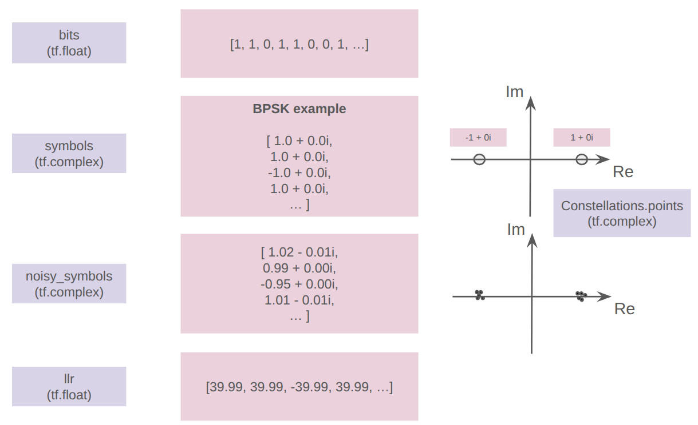
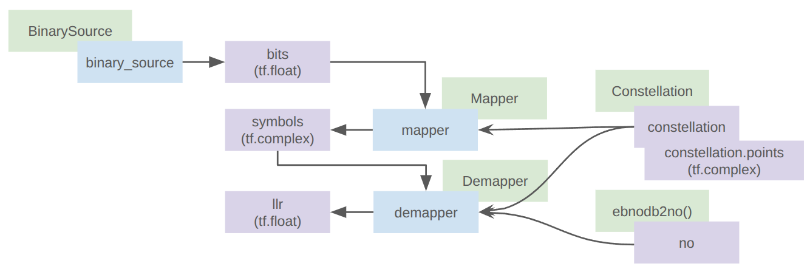
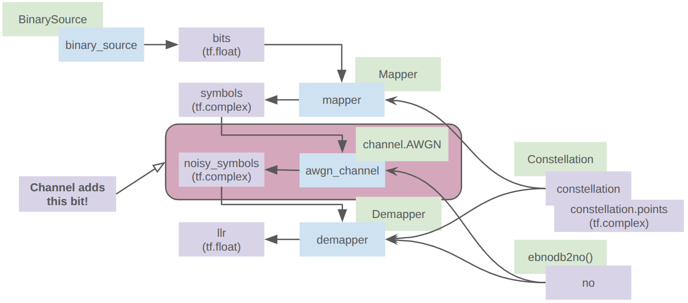
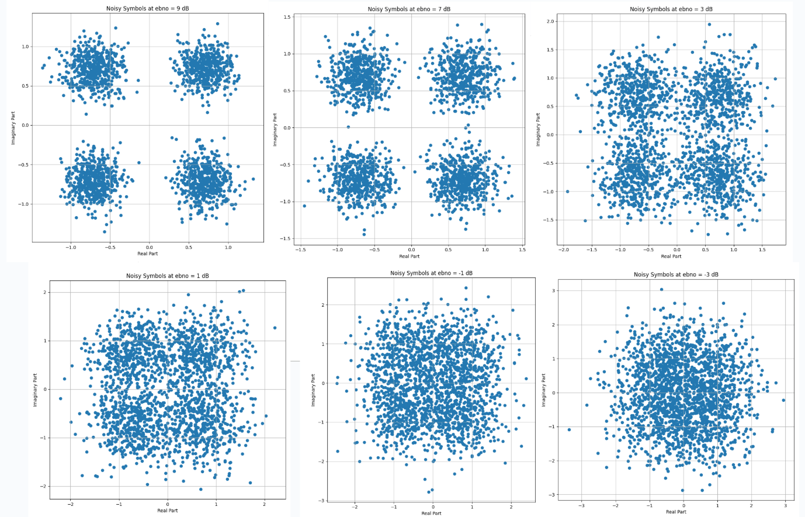
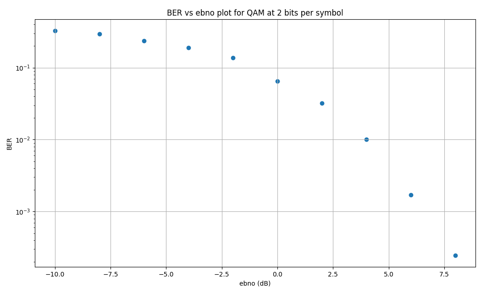

# Basic Physical Layer Communication Chains

## Resources

[Sionna Physical Layer Tutorial Part 1](https://nvlabs.github.io/sionna/phy/tutorials/Sionna_tutorial_part1.html#Imports-&-Basics)

[Sionna API Documentation for Demapper Class](https://nvlabs.github.io/sionna/phy/api/mapping.html#sionna.phy.mapping.Demapper)

[Sionna API Documentation for ebnodb2no Function](https://nvlabs.github.io/sionna/phy/api/utils.html#sionna.phy.utils.ebnodb2no)

## Simple Physical Layer Chains

A Sionna physical layer chain involves several basic steps:

1. Generating data bits
2. Mapping the data bits to symbols
3. Passing the symbols through a channel to add noise
4. Demapping the noisy symbols back into data bits

The important objects are shown in the figure below.

Note that the constellation shown in the figure is for BPSK, but the example below uses 4-QAM.

## No Noisy Channel

The figure below shows the components that compose a basic physical layer chain works in Sionna. Note this isn't using the concept of Sionna blocks yet (see next chapter [here](../03_sionna-blocks/README.md)).

## Adding a Noisy Channel

- Noise is introduced using various channel models such as `sionna.phy.channel.AWGN()`.
- The channel object is initiated with a noise variance, `no`. Convert between an EbN0 ratio and `no` using the function `ebnodb2no()`.

- `llr` is the log-likelihood ratio tensor.
- To output hard bit decisions from `llr` there are 2 options: using the `hard_out` option in the Demapper or use the utility function `hard_decisions()`.

The figure below shows the amount of noise introduced into the constellation for different values of `ebno`.

You can see that at `ebno` = -3 dB (signal power is roughly half the noise power) it's not even visually clear that we are using 4-QAM.  However we shall see that 

## BER vs `ebno` plot

The following figure is the BER vs EbN0 plot for 4-QAM without any forward error correction (FEC). Note the curve is not quite smooth, which can be resolved using a larger `BATCH_SIZE`.

Note a few things:
- At EbN0 = -3 dB, the BER is between 0.1 and 0.2 i.e 10% to 20% bit errors. This might be counter intuitive, as a -3 dB ratio means the energy power per bit is roughly half that of the noise.
- In the limit of small EbN0 ratios, the BER seems to converge towards a value of ~0.33 i.e 33% buts are erroneous.
