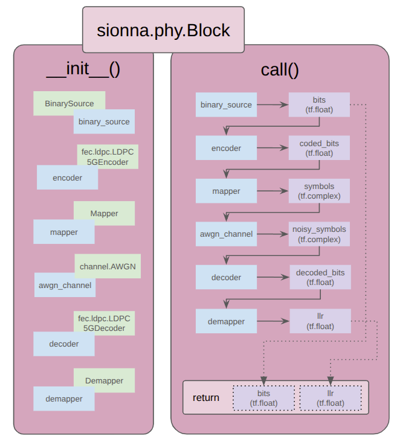

# Sionna Blocks and Exploring Encoding and Decoding for Forward Error Correction (FEC)

- BLER -> Block Error Rate, is different to Bit Error Rate (BER).
- Introducing encoder and decoder to the comms chain within a Sionna block.
- Do simply 3-repeater code.
- Look into automatic differentiation.

## Introducing Sionna blocks, along with encoder and decoder for FEC

A Sionna Block is a class for defining a particular comms chain. It implements two main functions:

1. `__init__()` : Sionna components (`mapper`, `awgn` etc.) composing the comms chains are initialised in here.
2. `call()` : Information bits are passed through the comms chain in here. This abstract function shold return the original generated bits and the llr, enabling the computation of statistics like BER.

Consider the following comms chain, which is like the chain in [chapter 02](../02_basic-phy-layer-chain/README.md) but adds an encoder and decoder for forward error correction (FEC).

If implemneted as a Sionna block, it looks like the schematic below:

Instantiation of this block can be used for computing comms statistics like BER.

## 

