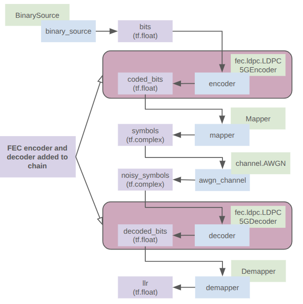

# Sionna Blocks and Exploring Encoding and Decoding for Forward Error Correction (FEC)

- BLER -> Block Error Rate, is different to Bit Error Rate (BER).
- Introducing encoder and decoder to the comms chain within a Sionna block.
- Do simply 3-repeater code.
- Look into automatic differentiation.

# Introducing Sionna blocks

